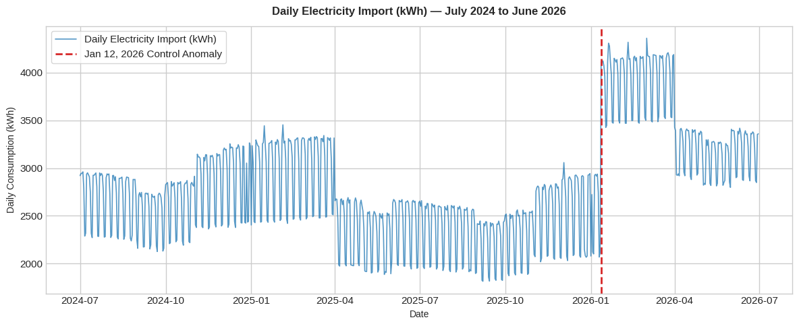
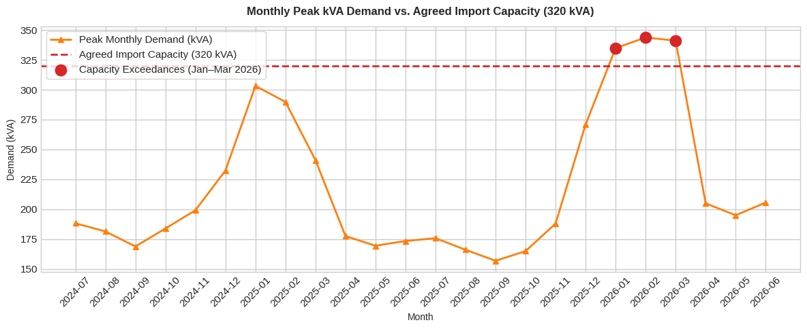

# UK Commercial Building Energy Assessment & Optimization

[](https://www.python.org/)
[](https://colab.research.google.com/github/)
[](https://opensource.org/licenses/MIT)

An end-to-end data analytics and commercial optimization assessment of two years (35,040 half-hourly intervals) of electricity consumption data for a UK commercial facility operating under a Time-of-Use (ToU) tariff structure.

The analysis evaluates building energy performance, isolates an unmonitored operational Building Management System (BMS) control failure, quantifies weather-normalized efficiency shifts using Ordinary Least Squares (OLS) regression, decomposes energy cost drivers, resolves kVA capacity exceedances, and outlines a prioritized implementation roadmap.

---

## 📸 Key Findings at a Glance

| Metric | Year 1 (2024/25) | Year 2 (2025/26) | Operational Variance |
| :--- | :--- | :--- | :--- |
| **Total Import Volume** | 990,104 kWh | 1,072,975 kWh | **+8.37%** (+82,871 kWh) |
| **Total Spend** | £186,038 | £215,663 | **+15.92%** (+£29,625) |
| **Weather-Expected Volume** | 990,104 kWh | 981,203 kWh | **+9.35%** Weather-Adj. Shift (+91,772 kWh) |
| **Unoccupied Mean Load** | 93.95 kW | 105.33 kW | **+12.12%** (+60.4% post-Jan 12 fault) |
| **Peak Demand (kVA)** | 303.21 kVA | 343.79 kVA | **+13.38%** (11 breaches >320 kVA limit) |
| **Average Power Factor** | 0.938 | 0.917 | **-2.24%** (dipped to 0.855 min) |

---

## 💡 Executive Summary & Critical Insights

### 1. Operational Anomaly Detection (Jan 12, 2026 Control Fault)
* **Step-Change Identification**: The site was operating **8.98% more efficiently** in Year 2 until **Monday, January 12, 2026**, when a control override/setback failure occurred.
* **Unoccupied Baseload Jump**: Overnight and weekend baseline demand stepped up from **82.22 kW** to **131.89 kW** (+49.67 kW continuous excess load).
* **Direct Financial Loss**: Incurred **190,311 kWh** in excess consumption and **£36,038** in unnecessary energy cost across 5.5 months. Rectifying this fault yields **£36,000–£72,000/year** in recurring savings.
  


```text
Executive Performance Summary: Control Anomaly Impact
Performance Metric              Pre-Anomaly Baseline  Post-Anomaly Period  Absolute Shift  Impact / Variance
Unoccupied Mean Demand (kW)     82.22 kW              131.89 kW            +49.67 kW       +60.4% baseload increase
Occupied Mean Demand (kW)       143.33 kW             183.04 kW            +39.71 kW       +27.7% load increase
Average Power Factor            0.938                 0.893                -0.045          -4.8% Inductive motor load degradation
Daily Excess Energy Shift       ——                    ——                   +1,119.5 kWh/day Occupancy-adjusted daily excess
Effective Electricity Rate      ——                    £0.1894 / kWh        ——              Post-anomaly weighted average
Daily Financial Burn Rate       ——                    ——                   +£211.99/day    Ongoing daily financial loss
Total Excess Consumption        ——                    ——                   190,311.37 kWh  Cumulative extra energy
Direct Financial Cost of Fault  ——                    ——                   £36,038.18      Cumulative financial impact
```

### 2. Weather Normalization Analysis
* Year 2 was 10.9% milder in heating degree days ($\text{HDD}_{15.5} = 1,851.9$ vs $2,079.0$).
* An OLS regression model trained on Year 1 baseline data ($R^2 = 0.682$) projected an expected Year 2 consumption of **981,203 kWh**.
* The true weather-normalized operational deterioration was **+91,772 kWh (+9.35%)**, confirming that efficiency loss was driven by internal control failures rather than weather dynamics.

```text
Ordinary Least Squares (OLS) regression model

=================== 1. MODEL VALIDATION ===================
R-squared                 : 0.6819  (Target: >0.75)
CV(RMSE)                  : 8.42%    (Target: <15.0%)
NMBE                      : -0.00%     (Target: +/- 5.0%)

================== 2. MODEL COEFFICIENTS ==================
Base Load (Intercept)     : 2064.80 kWh/day (p=0.000)
Heating Sensitivity (HDD) : 33.30 kWh/HDD (p=0.000)
Cooling Sensitivity (CDD) : 51.29 kWh/CDD (p=0.016)
Workday Added Load        : 634.92 kWh/day (p=0.000)

=================== 3. DECOMPOSED IMPACT ===================
Actual Year 1 Total       : 990,104.36 kWh
Expected Year 2 Total     : 981,203.28 kWh  (Baseline Model + Y2 Weather)
Actual Year 2 Total       : 1,072,975.33 kWh
------------------------------------------------------------------------------------------------------------------------------------
  └─ Weather Impact (expected_y2 - actual_y1)                                     : -8,901.07 kWh (Expected reduction)
  └─ Weather-Normalized / Non-Weather Operational Shift (actual_y2 - expected_y2) : +91,772.05 kWh (+9.35%) True efficiency loss
  └─ Total Raw Change (weather_impact + operational_shift)                        : +82,870.98 kWh (+8.37%)
```

### 3. Tariff & Cost Decomposition
* The +£29,625 (+15.92%) annual spend increase was mathematically decomposed into:
  1. **Unit Rate Inflation**: **+£12,014 (+6.46%)** from ToU rate increases across Red, Amber, and Green bands.
  2. **Volume Growth**: **+£16,523 (+8.88%)** driven by the post-Jan 12 control fault.
  3. **Capacity Charges**: **+£1,088 (+0.58%)** from higher agreed capacity rates (£0.095 $\rightarrow$ £0.105/kVA/day) and kVA exceedance penalties.
 
```text
=== ANNUAL COST COMPONENTS BREAKDOWN ===
period_year                   energy_import_cost  allocated_capacity_charge  excess_capacity_charge  total_cost
0 Year 1 (Jul 24 - Jun 25)           £174,655.30                 £11,382.82                   £0.00 £186,038.12
1 Year 2 (Jul 25 - Jun 26)           £203,192.36                 £12,469.30                   £1.78 £215,663.44

=== COST VARIANCE & INFLATION DECOMPOSITION ===
Year 1 Total Spend:            £186,038.12
  + Unit Rate Inflation Effect:  +£12,013.88 (+6.46%)
  + Volume Increase Effect:      +£16,523.18 (+8.88%)
  + Capacity Charge Increase:    +£1,088.26 (+0.58%)
Year 2 Total Spend:            £215,663.44 (+15.92%)
```

### 4. Power Factor Correction & Capacity Limits
* The facility experienced **11 half-hourly capacity exceedances** exceeding the **320 kVA Agreed Import Capacity** (peaking at 343.79 kVA).
* Real active power ($303.50\text{ kW}$) never exceeded 320 kW. All exceedances were caused by degraded power factor ($\text{PF} \approx 0.855\text{--}0.898$) during morning plant restart windows (08:00–09:30).
* **Corrective Proof**: Restoring site power factor to $\ge 0.95$ via a 60 kVAR capacitor bank reduces peak apparent power to $319.47\text{ kVA}$, completely eliminating **100% of capacity exceedances** without requiring load curtailment.


_vs._Apparent_Power_(kVA)_&_Power_Factor_Boundaries.png)
.png)

---

## 🎯 Actionable Implementation Roadmap

| # | Action Item | Priority | Est. CapEx (£) | Est. Annual Savings (£/yr) | Simple Payback |
| :--- | :--- | :--- | :--- | :--- | :--- |
| **1** | **BMS Setback & Override Audit** | P1 - High | £0 – £500 | £36,000 – £72,000 | **< 1 Week** |
| **2** | **Morning HVAC Plant Staggering** | P2 - Medium | £0 – £1,000 | £2,000 – £5,000 | **1–2 Months** |
| **3** | **Power Factor Correction (PFC) Unit** | P2 - Medium | £4,000 – £8,000 | £3,000 – £6,000 | **12–18 Months** |
| **4** | **Automated BMS Exception Alerts** | P3 - Ongoing | £1,500 – £3,000 | £5,000 – £10,000 | **< 6 Months** |
| **TOTAL** | **Full Portfolio Investment** | — | **£9,000 (Avg)** | **£69,500 / year** | **1.6 Months** |

---
## 🚀 Quick Start

### Google Colab
Launch the pipeline instantly in your browser with zero setup:

[](https://colab.research.google.com/drive/1YKIQpaAJOi8OQYSqbNwae80M6RlL3tdQ?usp=sharing)

---
## 📁 Repository Structure

```text
├── building_energy_performance_analytics.ipynb # Interactive Google Colab Notebook
├── energy_dataset.xlsx      # Raw synthetic half-hourly dataset
├── requirements.txt         # Python dependencies
├── README.md                # Executive summary & documentation
├── plots/
    ├── Daily_Electricity_Import.png
    ├── Monthly_Peak_kVA_Demand_vs_Agreed_Import_Capacity.png
    ├── Active_Power_(kW)_vs._Apparent_Power_(kVA)_&_Power_Factor_Boundaries.png
    ├── Average_Diurnal_Power_Factor_Profile_(Pre-_vs._Post-Jan_12,_2026).png
```

---
## 🛠️ Tech Stack & Requirements
* Python 3.9+
* Data Processing: `pandas`, `numpy`
* Statistical Modeling: `statsmodels` (OLS Regression)
* Visualization: `matplotlib`, `seaborn`
* Spreadsheet Ingestion: `openpyxl`
---
## 📝 License
Distributed under the MIT License. See `LICENSE` for details.
